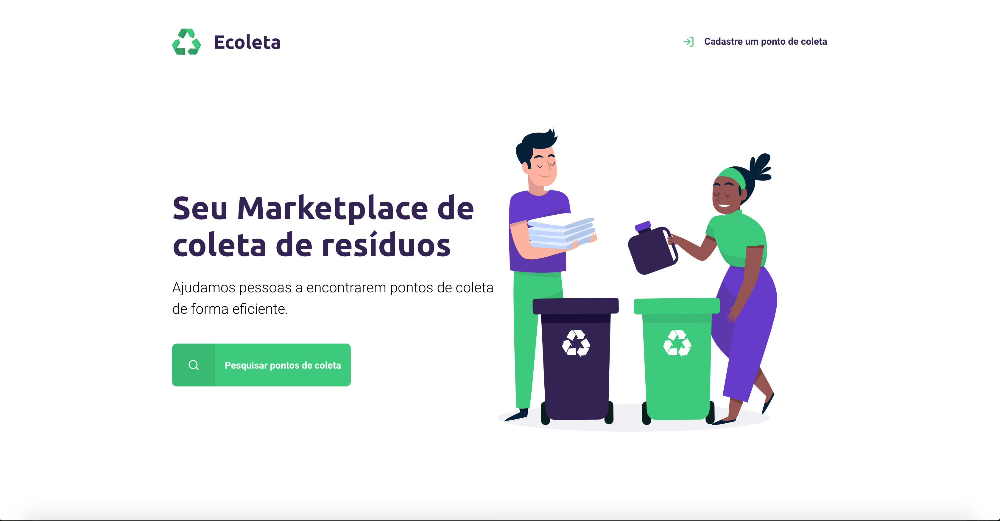
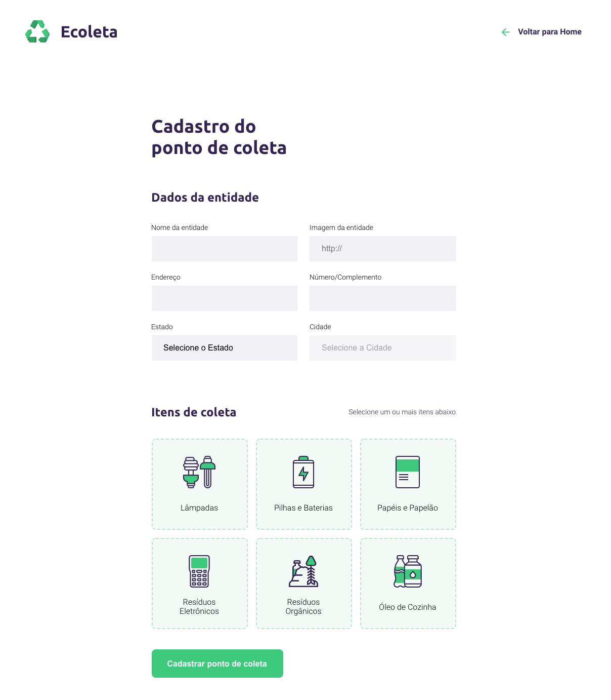
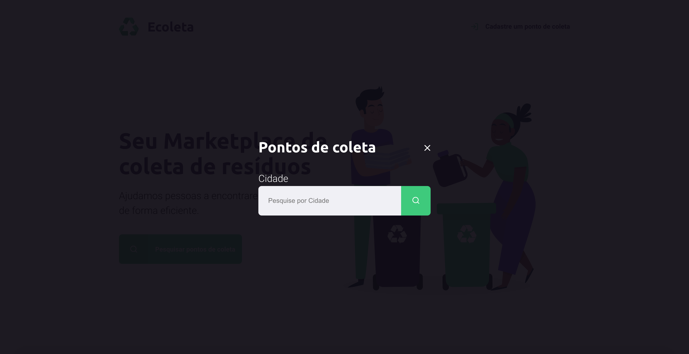
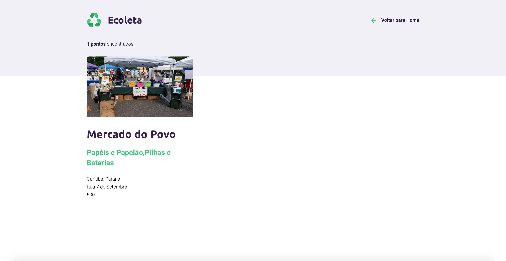

<h1 align="center">
    
</h1>

## 💻 About project

♻️ Ecoleta - is a way to connect companies and entities that collect several kinds of waste to people who need to dispose of their waste in an ecological way.

Companies or entities may register on the web platform by sending:

-   entity name
-   url image
-   address
-   city and uf
-   in addition, they can select one or more collection items:
    -   Lamps
    -   Batteries
    -   Papers and Cardboard
    -   Electronic Waste
    -   Organic Waste
    -   Kitchen Oil

Users will have access to the web application, where they can search through City name and the application will show the entities registered in that location.

## 🎨 Layout

### Web

<p align="center" style="display: flex; align-items: flex-start; justify-content: center;">
  

  
  
  
</p>

## 🛠 Technology

#### **Website**

-   **[HTML5](https://developer.mozilla.org/pt-BR/docs/Web/HTML/HTML5)**
-   **[SCSS](https://sass-lang.com/documentation/syntax)**
-   **[JavaScript](https://developer.mozilla.org/pt-BR/docs/Web/JavaScript)**
-   **[Nunjucks](https://mozilla.github.io/nunjucks/)**

#### **Server** ([NodeJS](https://nodejs.org/en/))

-   **[Express](https://expressjs.com/)**
-   **[SQLite](https://github.com/mapbox/node-sqlite3)**

#### **Utilitaries**

-   Prototype: **[Figma](https://www.figma.com/)** &rarr;
-   API: **[IBGE API](https://servicodados.ibge.gov.br/api/docs/localidades?versao=1)** &rarr; **<kbd>[API de UFs](https://servicodados.ibge.gov.br/api/docs/localidades?versao=1#api-ufs-estadosget)</kbd>**, **<kbd>[API de Municípios](https://servicodados.ibge.gov.br/api/docs/localidades?versao=1#api-municipios-estadosufmunicipiosget)</kbd>**
-   Editor: **[Visual Studio Code](https://code.visualstudio.com/)** &rarr; Extensions: **<kbd>[SQLite](https://marketplace.visualstudio.com/items?itemname=alexcvzz.vscode-sqlite)</kbd>**
-   API test: **[Insomnia](https://insomnia.rest/)**
-   Icons: **[Feather Icons](https://feathericons.com/)**, **[Font Awesome](https://fontawesome.com/)**
-   Fonts: **[Ubuntu](https://fonts.google.com/specimen/ubuntu)**, **[Roboto](https://fonts.google.com/specimen/roboto)**

## 🚀 How to run the project

We can consider this project as being divided into two parts:

1. SCSS and JS (public folder)
2. Views and Database (src folder)

### Prerequisites

Before you begin, you will need to have the following tools installed on your machine:
[Git](https://git-scm.com), [Node.js][nodejs].

In addition, it is good to have an editor to work with the code as [VSCode][vscode]

### 🧭 Running the web application (Front End)

```bash
# Clone this repository
$ git clone https://github.com/luizmr/Starter

# Access the project folder in the cmd/terminal
$ cd Starter

# Install the dependencies
$ npm install

# Run the application in development mode
$ npm start

# The server will start at port:3000 - go to http://localhost:3000
```

## 📝 License

This project is under the MIT license.
